Stanford CS 144 Networking Lab
==============================
- [x] lab0
- [x] lab1
- [x] lab2
- [x] lab3   

# 1.  lab0 networking warmup
## 1.1. Set up GNU/Linux on your computer
ubuntu22.04LTS下执行
```bash
sudo apt update && sudo apt install git cmake gdb build-essential clang \
clang-tidy clang-format gcc-doc pkg-config glibc-doc tcpdump tshark
```
安装g++12.3.0
```bash
sudo add-apt-repository ppa:ubuntu-toolchain-r/ppa
sudo apt update
sudo apt install g++-12 -y
```
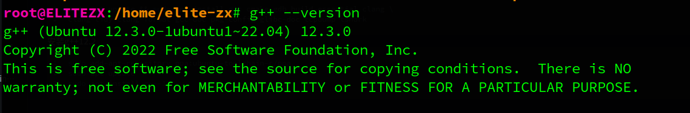
将minnow仓库上传到自己的仓库，参考[这个方法](https://stackoverflow.com/questions/10065526/github-how-to-make-a-fork-of-public-repository-private)
如果你做的是2023年之前的版本，需要用到sponge仓库，那么我[这里](https://github.com/Elite-zx/CS144-sponge)有一份未被修改过的版本
## 1.2. Networking by hand
### 1.2.1. Fetch a Web page
先提前准备好这3行首部信息，连接成功后快速复制进去，避免连接断开(`Connection closed by foreign host.`)
```http
GET /hello HTTP/1.1
Host: cs144.keithw.org
Connection: close
```
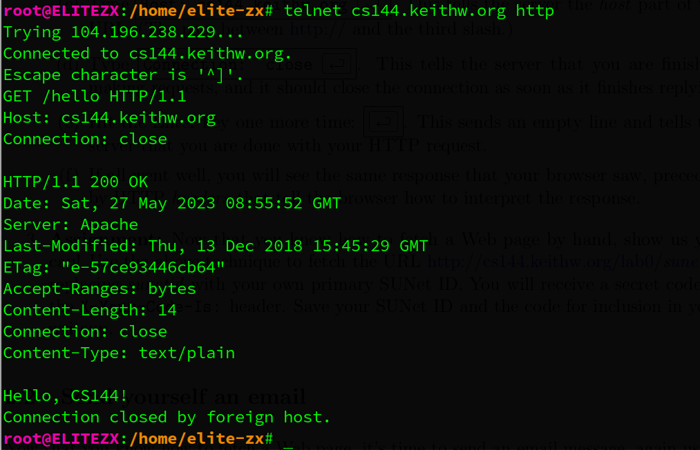
(Pretend to be a student at Stanford✌️)
```http
GET /lab0/elitezx HTTP/1.1
Host: cs144.keithw.org
Connection: close
```
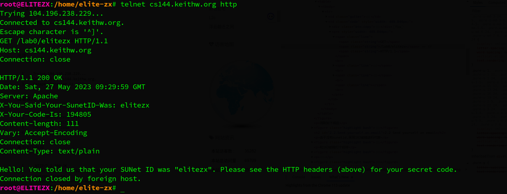
### 1.2.2. Send yourself an email
这个实现在 _自顶向下_ 的实验中已经完成过了，就不再重复了
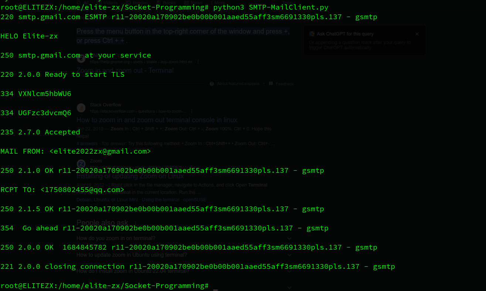
### 1.2.3. Listening and connecting
netcat监听一个端口， telnet 连接到一个端口使用telnet连接到一个端口，该端口必须处于监听状态
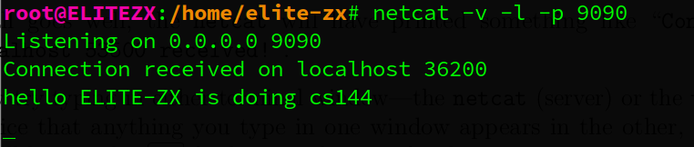
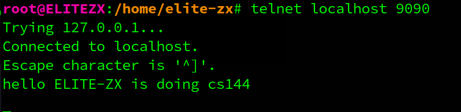
## 1.3. Writing a network program using an OS stream socket
### 1.3.1. Let’s get started—fetching and building the starter code
安装最新版的cmake，ubuntu22.04  follow [here](https://askubuntu.com/a/1157132/1681772)
```bash
cd minnow
cmake -S . -B build
cmake --build build
```
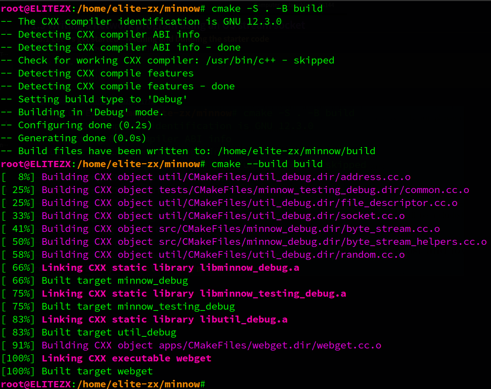
### 1.3.2. Modern C++: mostly safe but still fast and low-level
代码规范
### 1.3.3. Reading the Minnow support code
Adress
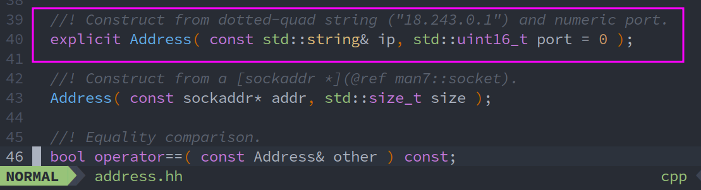
file_descriptor
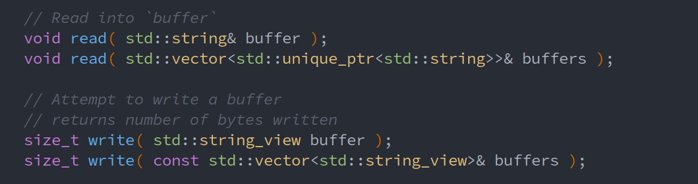
socket
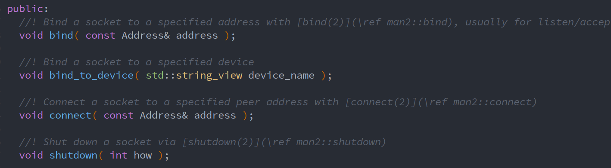
TCPSocket

### 1.3.4. Writing webget
根据提供的类，可以很轻松的写出来（10行够了，但完整和规范）。注意write接受string_view的对象，但是该类不能使用'+'运算符，因此用string代替。string_view和string的区别在于string_view只能被访问而不能被修改( refer to a constant contiguous sequence),，而string可以追加、删除和修改字符
```cpp
void get_URL( const string& host, const string& path )
{
  // cerr << "Function called: get_URL(" << host << ", " << path << ")\n";
  // cerr << "Warning: get_URL() has not been implemented yet.\n";
  TCPSocket tcp_socket {};
  const Address target_addr( host, "http" );
  tcp_socket.connect( target_addr );
  string request { "GET " + path + " HTTP/1.1\r\n" }; // can not use '+' in string_view object
  cout << request;
  string header0 { "Host: " + host + "\r\n" };
  cout << header0;
  string_view header1 { "Connection: close\r\n" };
  cout << header1;
  string_view empty_line { "\r\n" };
  cout << empty_line;
  tcp_socket.write( request );
  tcp_socket.write( header0 );
  tcp_socket.write( header1 );
  tcp_socket.write( empty_line );
  string rcv_buffer;
  while ( !tcp_socket.eof() ) {
    tcp_socket.read( rcv_buffer );
    cout << rcv_buffer;
    rcv_buffer.clear();
  }
  tcp_socket.close();
  // destructor
}
```
```bash
./apps/webget cs144.keithw.org /hello
```
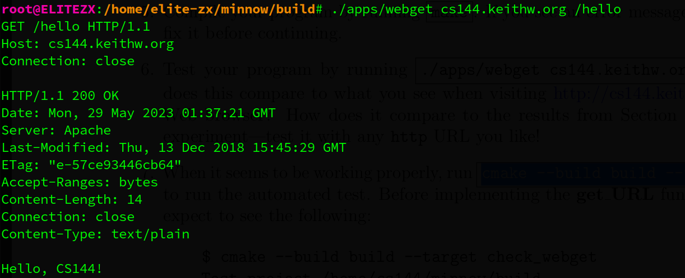
```bash
cmake --build build --target check_webget
```
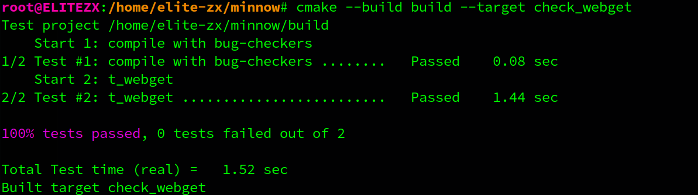
## 1.4. An in-memory reliable byte stream
### 1.4.1. target
在 "An in-memory reliable byte stream" 这一小节中，文档要求你**实现一个可靠的字节流**。这个字节流需要满足以下几个条件：
- 字节流是有限的：写入者可以结束输入，然后就不能再写入更多的字节。当读取者读到流的末尾时，它将到达“EOF”（文件结束），并且不能再读取更多的字节。
- 字节流也需要进行流量控制，以限制其在任何给定时间的内存消耗。对象在初始化时会有一个特定的\_capacity：它在任何给定点愿意在自己的内存中存储的最大字节数。字节流将限制写入者在任何给定时刻可以写入的量，以确保流不会超过其存储容量。当读取者读取字节并从流中排出它们时，写入者被允许写入更多。
- 字节流的使用是在单线程中，你不需要担心并发的写入者/读取者、锁定或竞争条件。

你需要实现以下的接口：
对于写入者：
- void push( std::string data ); // 将数据推送到流中，但只能推送可用容量允许的量。
- void close(); // 表示流已经结束。不会再有更多的写入。
- void set_error(); // 表示流出现了错误。
- bool is_closed() const; // 流是否已经关闭？
- uint64_t available_capacity() const; // 现在可以推送到流中的字节数是多少？
- uint64_t bytes_pushed() const; // 累计推送到流中的总字节数。

对于读取者：
- std::string_view peek() const; // 查看缓冲区中的下一个字节
- void pop( uint64_t len ); // 从缓冲区中移除 `len` 个字节
- bool is_finished() const; // 流是否已经结束（已关闭并完全弹出）？
- bool has_error() const; // 流是否出现过错误？
- uint64_t bytes_buffered() const; // 当前缓冲的字节数（已推送但未弹出）
- uint64_t bytes_popped() const; // 累计从流中弹出的总字节数。

你需要打开 src/byte_stream.hh 和 src/byte_stream.cc 文件，并实现提供这个接口的对象。在你开发字节流实现的过程中，你可以使用 cmake --build build --target check0 运行自动化测试。如果所有测试都通过，check0 测试将会运行你的实现的速度基准测试。
### 1.4.2. source code
byte_stream.hh
```cpp
class ByteStream
{
protected:
  uint64_t capacity_;
  // Please add any additional state to the ByteStream here, and not to the Writer and Reader interfaces.
  std::deque<char> mem_buf;
  size_t bytes_pushed_cnt;
  size_t bytes_poped_cnt;
  bool is_end;
  bool is_err;

public:
...
}
```
byte_stream.cc
```cpp
ByteStream::ByteStream( uint64_t capacity )
  : capacity_ { capacity }
  , mem_buf {}
  , bytes_pushed_cnt { 0 }
  , bytes_poped_cnt { 0 }
  , is_end { false }
  , is_err { false }
{}

void Writer::push( string data )
{
  // Your code here.
  size_t allowed_size { 0 };
  allowed_size = min( data.length(), capacity_ - mem_buf.size() ); // flow-controlled
  data = data.substr( 0, allowed_size );
  for ( const char& c : data )
    mem_buf.push_back( c );
  bytes_pushed_cnt += allowed_size;
}

void Writer::close()
{
  // Your code here.
  is_end = true;
}

void Writer::set_error()
{
  // Your code here.
  is_err = true;
}

bool Writer::is_closed() const
{
  // Your code here.
  return is_end;
}

uint64_t Writer::available_capacity() const
{
  // Your code here.
  return capacity_ - mem_buf.size();
}

uint64_t Writer::bytes_pushed() const
{
  // Your code here.
  return bytes_pushed_cnt;
}

string_view Reader::peek() const
{
  // Your code here.
  return string_view { &mem_buf.front(), 1 }; // const char*
}

bool Reader::is_finished() const
{
  // Your code here.
  return is_end && mem_buf.empty();
}

bool Reader::has_error() const
{
  // Your code here.
  return is_err;
}

void Reader::pop( uint64_t len )
{
  // Your code here.
  len = min( len, mem_buf.size() ); // avoid illegal len
  int _size = len;
  while ( _size-- > 0 )
    mem_buf.pop_front();
  bytes_poped_cnt += len;
}

uint64_t Reader::bytes_buffered() const
{
  // Your code here.
  return mem_buf.size();
}

uint64_t Reader::bytes_popped() const
{
  // Your code here.
  return bytes_poped_cnt;
}
```
### 1.4.3. result
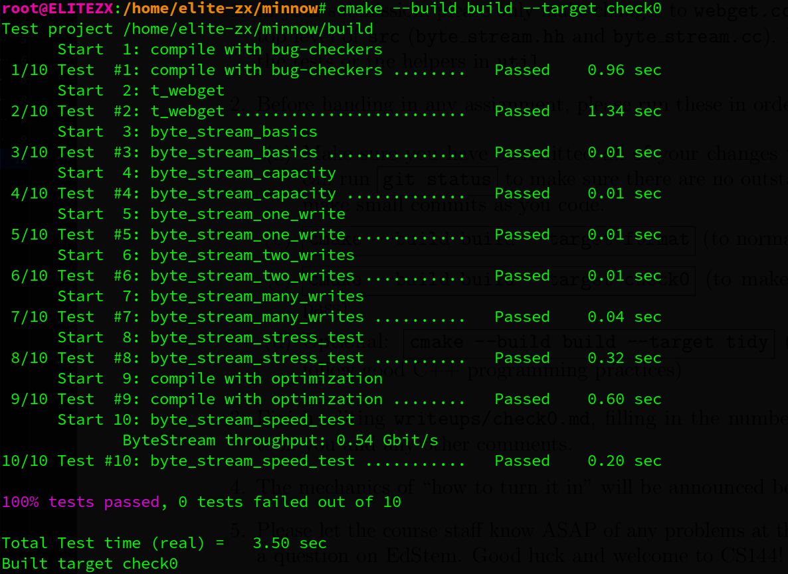 
# 2. lab1 stitching substrings into a byte stream
## 2.1. target
将远程仓库的 `check1-startercode` 分支的更改合并到当前所在的main分支，重新cmake
```bash
git merge origin/check1-startercode
cmake -S . -B build
cmake --build build
```
在这个实验和下一个实验中，你将实现一个TCP接收器：这个模块接收数据报，并将它们转换成一个可靠的字节流，以便应用程序从套接字中读取——就像你在Checkpoint 0中的webget程序从webserver中读取字节流一样。

TCP发送器将其字节流分割成短的段（子字符串，每个不超过约1460字节），以便它们每个都能装入一个数据报。但是，网络可能会重新排序这些数据报，或者丢弃它们，或者多次传送它们。接收器必须将这些段重新组装成它们开始时的连续字节流。

在这个实验中，你将编写一个负责这种重组的数据结构：**一个Reassembler**。它将接收子字符串，由一串字节和该字符串在更大流中的第一个字节的索引组成。流的每一个字节都有它自己的唯一索引，从零开始并向上计数。
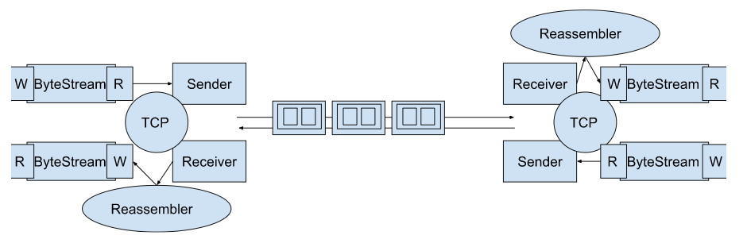
## 2.2. analyze
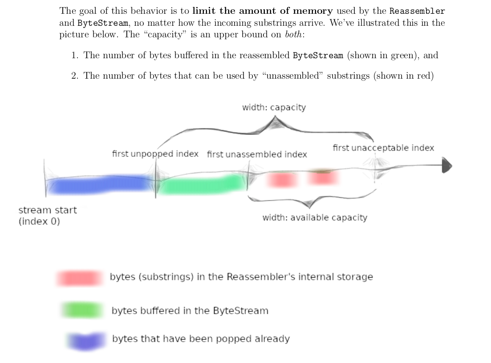
首先理解内存限制的要求。ByteStream对象的capacity分为了两个部分，一个是用于字节流的buffer，用于存储重组好的有序字节流，这是对writer对象和reader对象而言的。一个是用于未重组的字节流的缓冲，可通过available_capacity()方法获取，这是reassembler对象而言的。因为capacity是固定的，意味着如果pop的频率太小，那么capacity被有序字节流填满，此时重组器reassembler会停止工作，因为它的存储空间available_capacity为0。

其次，实现这个reassembler最大的难点在于：如何**处理重叠的子串**。比如first_unassemble_index(期望接受的第一个有序字节)是'a'，但是先后来了子串'bc'，'c'，这两个子串就要缓存在reassembler的内存空间中(大小为available capacity, 如果该值大于2的话)。我们需要在将c加入子串的时候，执行remove_overlapping操作，将这两个重叠子串合并为'bc'，这样确保reassembler中缓存空间中不存在重叠子串。换句话说，就是在新的子串要缓存时，在加入前先与缓存中重叠的子串执行合并操作，以确保加入后缓存中不存在重复子串，合并后bytes_pending（`unordered_bytes_size`）减去相应子串的大小。这样的目的是节省内存空间，并且在期望的有序字节达到`last_index + 1 == begin_index`时，也能快速的与缓存中的相邻子串合并然后通过writer的push函数push到reader的buffer中。

不仅如此，我们对新来的子串，在合并操作前，我们还要**确保该子串是合法的**，即该子串是在first_unassembled_index（`output.bytes_pushed()`）和first_unacceptable_index-1（`output.bytes_pushed()+output.available_capacity() - 1`）之间的，也就是说该子串的字节即不是已经被pop的，也不是到了buffer中的，更不是capacity之外的(否则会超出容量)，这个可以通过判断边界值做到。

在选择数据结果的问题上，我一开始为了效率（`string next_substring = unordered_bytes_buffer[first_index]`更快一点），选择了unordered_map,但是后来在test阶段，发现遍历reassembler的缓存unordered_bytes_buffer时，必须按first_index从小到大遍历，否则合并操作会出现遗漏，而unordered_map无法指定遍历顺序，因为哈希值我是不知道的，于是换成了能自动根据key值排序(默认从小到大)的map

在判断是否Finish的问题上，除了要满足达到接受方的流is_last_substring为true，还要满足reassembler已经通过writer的push函数将所有有序字节push到了buffer中，即`output.bytes_pushed() = first_index + data.size()`

完成这个实验是不容易的，说实话我看把文档看懂让我究竟干什么都花了1个小时，花了一上午写好初始代码，结果一开始只能通过8个test用例，调试了一下午，逐步通过cap,dup...。这期间加入了很多cout语句（很管用），因为我对gdb还不咋熟悉，而且这文件也太多了。 最后测试到win又报错了，这个时候分析打印结果不太可行了，于是我硬着头皮又重新过了一遍自己的代码，发现是合并操作计算边界时+1,-1问题，最后成功通过test！
## 2.3. source code
### reassembler.hh
```cpp
class Reassembler
{
public:
  ...
private:
  size_t next_index = 0; // the next ordered index,which will push to bytestream by writer
  size_t unordered_bytes_size = 0;
  std::map<size_t, std::string> unordered_bytes_buffer {}; // store unordered bytes
  bool byte_stream_end = false;
  size_t eof_index = 0;

  // function:let string legal
  void process_substr( uint64_t& first_index, std::string& data, Writer& output );
  // make sure no overlapping in reassembler buffer
  void remove_overlap( uint64_t& first_index, std::string& data );
};
```
### reassembler.cc
```cpp
#include "reassembler.hh"
#include "byte_stream.hh"
#include <chrono>
#include <cstdint>
#include <iostream>
#include <iterator>
#include <math.h>

using namespace std;

void Reassembler::insert( uint64_t first_index, string data, bool is_last_substring, Writer& output )
{
  // Your code here.
  process_substr( first_index, data, output );
  cout << "next_index: " << next_index << endl;
  if ( first_index == next_index ) {
    string next_substring = unordered_bytes_buffer[first_index];
    cout << "push to buffer!" << endl;
    output.push( next_substring );
    unordered_bytes_size -= next_substring.size();
    unordered_bytes_buffer.erase( first_index ); // key_type
  }
  cout << "unordered_bytes_size: " << unordered_bytes_size << endl << endl;
  if ( is_last_substring ) // all bytes arrived
  {
    byte_stream_end = true;
    eof_index = first_index + data.size();
  }
  if ( byte_stream_end && output.bytes_pushed() == eof_index ) // all bytes pushed
  {
    cout << "All done!" << endl << endl << endl;
    output.close();
  }
}

void Reassembler::process_substr( uint64_t& first_index, string& data, Writer& output )
{
  /* within the stream’s available capacity():
   * [first_unassembled index,first unacceptable index]*/

  if ( !data.size() ) // empty input , will make last_index invalid (unsigned int -> -1 -> max int)
  {
    cout << "empty input!" << endl;
    return;
  }
  size_t begin_of_storage = output.bytes_pushed();                            // first_unassembled index
  size_t end_of_storage = begin_of_storage + output.available_capacity() - 1; // first unacceptable index -1
  size_t last_index = first_index + data.size() - 1;
  next_index = begin_of_storage;

  cout << "begin of storage: " << begin_of_storage << endl;
  cout << "end_of_storage: " << end_of_storage << endl;
  cout << "last_index: " << last_index << endl;
  cout << "first_index: " << first_index << endl;

  if ( begin_of_storage > end_of_storage ) // buffer is full, waiting for ReadAll
  {
    cout << "buffer is full and storage of reassembler is empty!" << endl;
    return;
  }
  if ( first_index > end_of_storage || last_index < begin_of_storage ) // out of range
  {
    cout << "index out of range!" << endl;
    return;
  } else if ( first_index < begin_of_storage && last_index >= begin_of_storage ) {
    cout << "keep tail!" << endl;
    data = data.substr( begin_of_storage - first_index ); // keep tail
    first_index = begin_of_storage;                       // update first_index
  } else if ( first_index >= begin_of_storage && last_index > end_of_storage ) {
    cout << "keep head!" << endl;
    data = data.substr( 0, end_of_storage - first_index + 1 ); // keep head
  }

  // cout << "string process is done!" << endl;
  // cout << data << endl;
  remove_overlap( first_index, data );
  // cout << "is not  overlap error" << endl;
  unordered_bytes_buffer[first_index] = data;
  unordered_bytes_size += data.size();
  return;
}

void Reassembler::remove_overlap( uint64_t& first_index, std::string& data )
{
  if ( !unordered_bytes_buffer.size() )
    return;

  for ( auto iter = unordered_bytes_buffer.begin(); iter != unordered_bytes_buffer.end(); ) {
    size_t last_index = first_index + data.size() - 1;
    size_t begin_index = iter->first;
    size_t end_index = iter->first + iter->second.size() - 1;
    cout << "begin_index: " << begin_index << " "
         << "end_index: " << end_index << endl;
    cout << "first_index: " << first_index << " "
         << "last_index: " << last_index << endl;

    if ( last_index + 1 == begin_index ) {
      cout << "exactly append!" << endl;
      data += iter->second;
      unordered_bytes_size -= iter->second.size();
      iter = unordered_bytes_buffer.erase( iter ); // not use erase(key), it will casue iterator invalid
    }
    // Overlap between head and tail.
    else if ( first_index <= begin_index && begin_index <= last_index ) { // = reason : "bc" "b"
      cout << "append tail!" << endl;
      if ( end_index <= last_index ) { // completely covered
        unordered_bytes_size -= unordered_bytes_buffer[begin_index].size();
        iter = unordered_bytes_buffer.erase( iter );
      } else {
        data += iter->second.substr( last_index - begin_index + 1 );
        unordered_bytes_size -= unordered_bytes_buffer[begin_index].size();
        iter = unordered_bytes_buffer.erase( iter );
      }
    }

    else if ( begin_index <= first_index && first_index <= end_index ) { // = reason: "bc" "c"
      cout << "append head!" << endl;
      if ( last_index <= end_index ) {
        first_index = begin_index;
        data = iter->second;
        unordered_bytes_size -= iter->second.size();
        iter = unordered_bytes_buffer.erase( iter );
      } else {
        data = iter->second.substr( 0, first_index - begin_index ) + data;
        unordered_bytes_size -= iter->second.size();
        iter = unordered_bytes_buffer.erase( iter );
        first_index = begin_index;
      }
    } else {
      ++iter;
    }
    cout << "after removing overlapping---"
         << "first_index: " << first_index << " last_index: " << first_index + data.size() - 1;
  }
}

uint64_t Reassembler::bytes_pending() const
{
  // Your code here.
  return unordered_bytes_size;
}

```
## 2.4. result
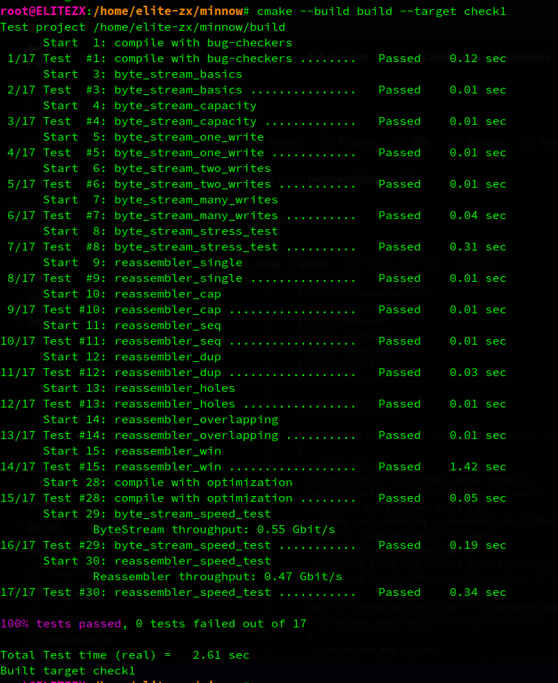
# 3. lab2 the TCP receiver
## 3.1. Translating between 64-bit indexes and 32-bit seqnos
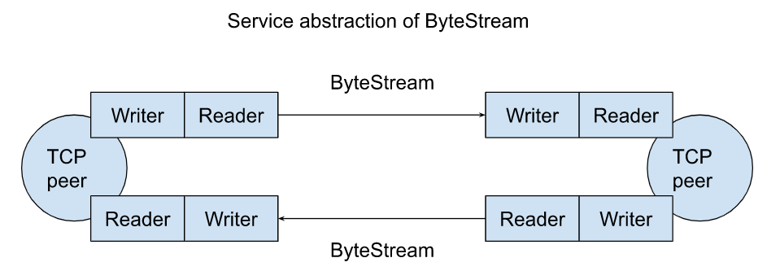

首先要解决的问题是，TCP有限的字节序列字段造成的有限字节序列范围进而导致的回绕问题，我们需要在永不会溢出的64位绝对序号和会发生回绕的32位相对序号之间实现转换，因为对重组器来说，字节流是从0开始的不会回绕的序列。此外，TCP随机的初始字节序号(ISN)为这个问题增加了难度
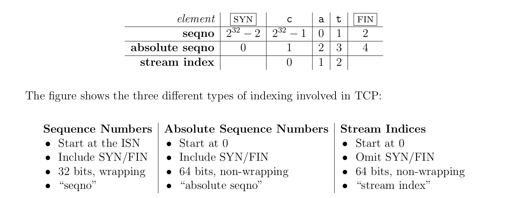
### 3.1.1 wrap---absolute seqno to seqno
把绝对序号转换为相对序号的wrap函数很简单，n的高32位表示绕了多少圈然后从0计数，带入这部分计算没有意义。因此截去n的高32位而将n的低32位与ISN相加即可得到目标相对序列（注释中有取余数的版本）
```cpp
Wrap32 Wrap32::wrap( uint64_t n, Wrap32 zero_point )
{
  // Your code here.
  // return Wrap32 { static_cast<uint32_t>( ( n + zero_point.raw_value_ ) % ( 1ul << 32 ) ) };
  return zero_point + static_cast<uint32_t>( n );
}

```
### 3.1.2 unwrap--- seqno to absolute seqno
这个函数给我干沉默了，我连别人的答案和解释都看不懂，说句惭愧的，我拿这玩意起码问了chatgpt几个小时，想了好几个小时，我都没整明白这个if语句是怎么来的，什么回绕之后ans要减去$2^{32}$，搞不懂。我说我在这个函数上磨了一天的时间都不夸张，还是理解不了，不管它了。
```cpp
uint64_t Wrap32::unwrap( Wrap32 zero_point, uint64_t checkpoint ) const
{
  uint64_t uint32_range = 1ul << 32;
  uint32_t offset = this->raw_value_ - wrap( checkpoint, zero_point ).raw_value_;
  uint64_t ans = checkpoint + offset;

  if ( offset >= 1ul << 31 && ans >= uint32_range ) // ?
    ans -= uint32_range;
  return ans;
  // Your code here.
}
```
## 3.2. Implementing the TCP receiver
### 3.2.1 receive
对收到的message,首先要判断是否是SYN握手信息，并在收到此信息之后进入数据交换阶段（tcp连接已建立），因此要有一个bool变量`after_handshaking`标志现在是否处于三次握手之后的状态。在收到SYN后，因为SYN被置1的包的序号是发送端的随机初始序号ISN，因此将zero_point置为该值以便后续将相对序号`seqno`转变为绝对序号`absolute_seqno`。（为了声明和赋值zero_point成员变量，要在Wrap32类中添加指定的默认构造函数(= default)，复制构造函数和重载赋值运算符（这两个必须同时实现））
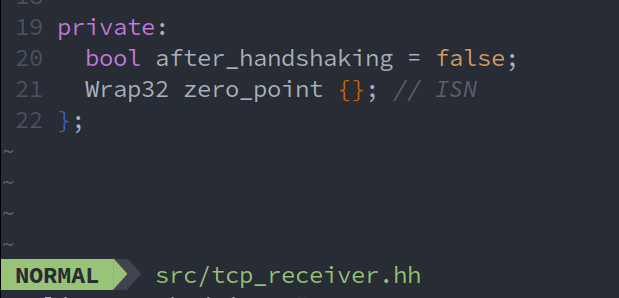
因为重组器对收到的字节流，从0编号，因此传递给reassembler的first_index要去除SYN所占的序号(如果存在SYN)，用`first_index = absolute_seqno + message.SYN + -1`就可以一步解决（boolean类型为true时，本质是为1，反正false为0）
因此receive的实现如下
```cpp
void TCPReceiver::receive( TCPSenderMessage message, Reassembler& reassembler, Writer& inbound_stream )
{
  // Your code here.
  if ( !after_handshaking ) // no handshaking
  {
    if ( message.SYN ) {
      after_handshaking = true; // after handshaking
      zero_point = Wrap32 { message.seqno };
    } else {
      return;
    }
  }

  uint64_t checkpoint = inbound_stream.bytes_pushed() + 1; // first unassembled index
  uint64_t absolute_seqno = Wrap32( message.seqno ).unwrap( zero_point, checkpoint );
  uint64_t first_index = absolute_seqno + message.SYN + -1; // since zero, remove SYN if exist
  reassembler.insert( first_index, message.payload, message.FIN, inbound_stream );
}
```
### 3.2.2 send
TCP的接受端要向发送端反馈信息，实验的要求比实际情况是简化了的（不用为接受端的包生成随机初始序号），包括确认信息ackno和用于流量控制的窗口大小信息（rwnd, receiver window）window_size
- ackno：期望收到的下一个字节的序号（相对序号）
- window_size：结合lab1和下图，可以看出window_size就是重组器用于排序的存储空间(storage)，可直接通过writer的available_capacity函数获得
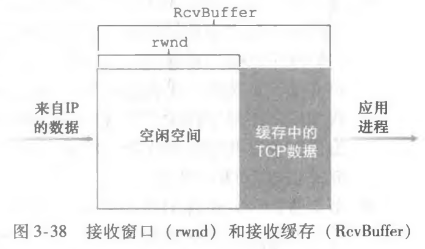
因此send函数的实现如下：
根据文档描述
>in TCP the SYN (beginning-of-stream) and FIN (end-of-stream) control flags are assigned sequence numbers. Each of these occupies one sequence number. (The sequence number occupied by the SYN flag is the ISN.) Each byte of data in the stream also occupies one sequence number.

如果接受方收到一个message后流结束了(`inbound_stream.is_closed()` )则说明该流包含FIN，而标志流结束的FIN还会占用一个序列号，所以此时next_expected_seq需要额外再加1
```cpp
TCPReceiverMessage TCPReceiver::send( const Writer& inbound_stream ) const
{
  // Your code here.
  TCPReceiverMessage msg;

  /*window_size*/
  uint64_t _available_capacity = inbound_stream.available_capacity();
  msg.window_size = _available_capacity > UINT16_MAX ? UINT16_MAX : _available_capacity;

  /*ackno*/
  if ( !after_handshaking ) {
    msg.ackno = nullopt; // or {} instead
  } else {
    uint64_t next_expected_seq = inbound_stream.bytes_pushed() + 1;
    if ( inbound_stream.is_closed() ) // FIN
      ++next_expected_seq;
    msg.ackno = zero_point + static_cast<uint32_t>( next_expected_seq ); // wrap
  }
  return msg;
}

```
## 3.3. result
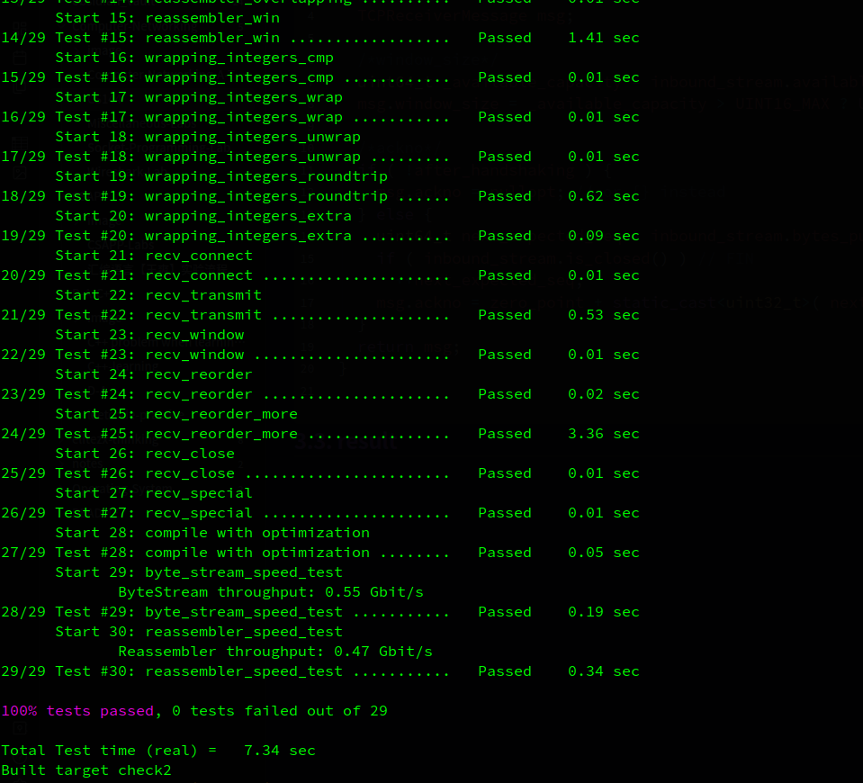
# 4. lab3 the TCP sender

下面讲讲实现过程中遇到的难点和debug过程
## 4.1tcp_sender.hh
[tcp_sender.hh](https://github.com/Elite-zx/CS144/blob/main/src/tcp_sender.hh)
在`tcp_sender.hh`实现一个Timer类，注意rest_time使用int64_t类型， 我一开始顺手写成uint64_t导致超时无法触发，debug后才发现。

## 4.2. tcp_sender.cc
[tcp_sender.cc](https://github.com/Elite-zx/CS144/blob/main/src/tcp_sender.cc)
### 4.2.1 设置FIN位
发送方向接受方发送FIN被置true的包以标志流的结尾(marked with the SYN flag at the beginning of the stream, and FIN flag at the end.)

包含的FIN的包有两种情况
- 一个数据包，其中FIN flag被置为true
即**有可用空间时在段中搭载 FIN**（Piggyback FIN in segment when space is available）
当outbound_stream中的数据均打包到data_seg中，stream is finished, 而接受窗口应该至少有一个空余字节(space is available))，此时要将最后一个数据包的FIN置1 (这里要多占一个字节）
看下图的测试用例，窗口的大小为8,而剩下的数据大小仅为4 bytes, 因此足以让最后一个数据包设置FIN位
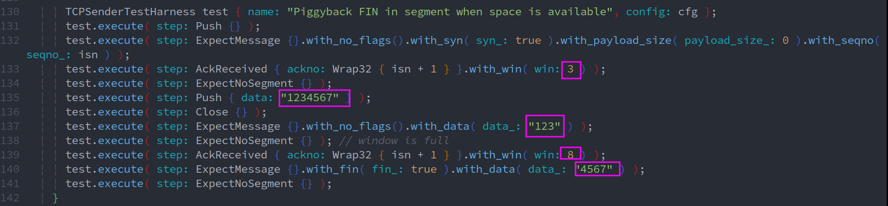

- 单独的一个FIN flag 包，payload为0
这种情况出现中，流传输完毕后，接受窗口被填满，此时**没有多余空间为最后一个数据包添加FIN位**，因此发送方在接受方的接受窗口有空余时，再发送一个单独的FIN包
看下图的测试用例，数据包正好占用了7个空间，填满了当前窗口 rwnd = 0 ，因此此时不能设置FIN位。在后续收到新的rwnd= 1的后，接受方知道有空余位置了，发送一个单独的FIN包


### 4.2.2 debug
遇到了一个很奇怪的测试用例"SYN+FIN"，这个用例要求我们同时设置SYN位和FIN位。首先发送方收到来自接受方的一个握手之前的ackno为nullopt的数据包(可能原因：网络延迟，旧链接断开之前的包在新链接建立之前达到)，接着发送方流向reader的流就关闭了，没有传出任何数据就关闭了。此时要求我们设置SYN+FIN的flag包，不包含任何数据负载。我只能在设置syn时检测流是否关闭从而通过这个测试用例，因为确实不知道什么情况下会有这样的包。
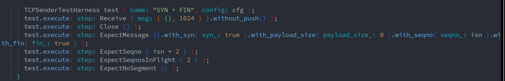
4.3. result
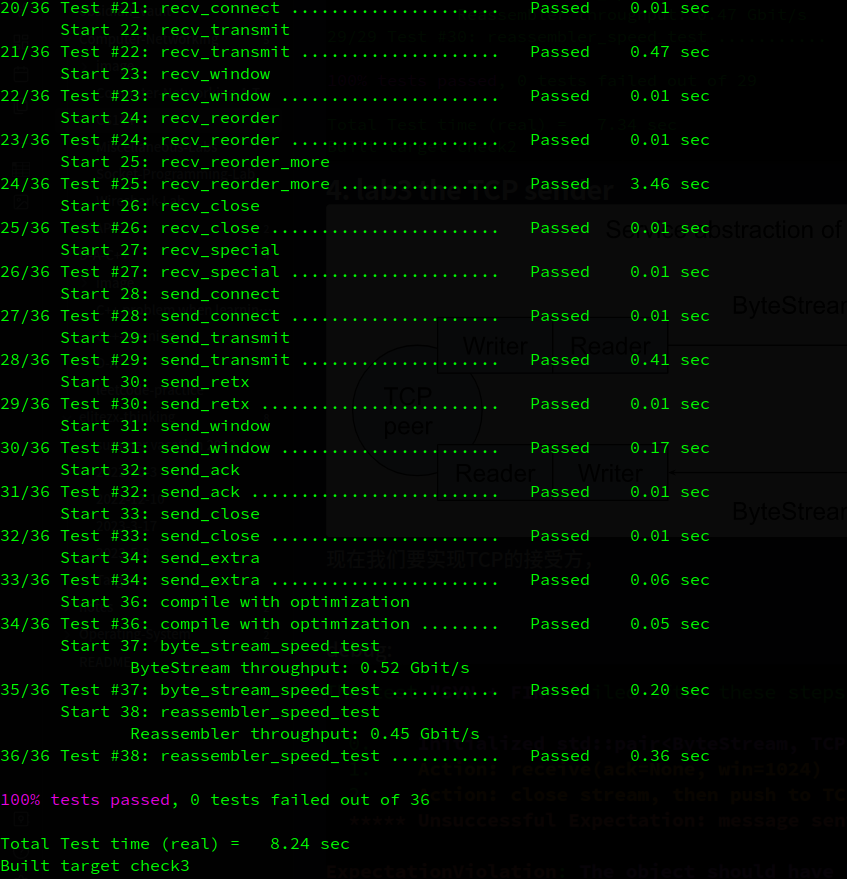
